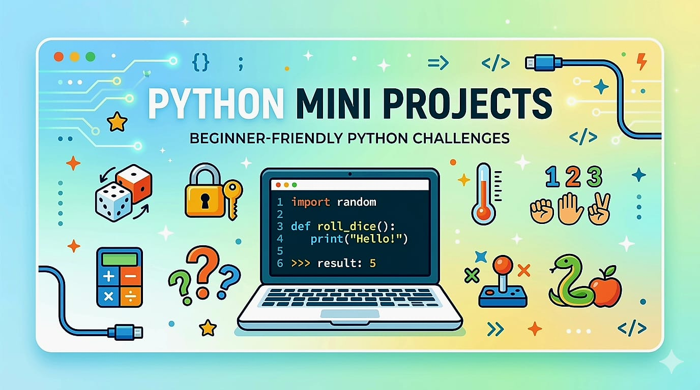

<h1 align = "center">  <b>PYTHON MINI PROJECTS </b> </h1>



Welcome to the **Python Mini Projects Repository**!  
This repository contains a collection of **simple beginner-level Python projects** developed by students as part of a learning exercise.

The goal of this repository is to help students:
- Practice **Python programming**
- Learn **Git and GitHub collaboration**
- Develop the habit of making **clear and frequent commits**

---

## 📚 About the Project

Each student is assigned **one mini project** through a GitHub Issue.  
Students must implement the program, commit their progress, and push their final solution to this repository.

These projects are designed to practice:

- Basic Python syntax
- User input and output
- Conditional statements
- Loops
- Random number generation
- Simple program design

---

## 📂 List of Projects

1. 🔐 Password Generator  
2. ❓ Simple Quiz Game  
3. ⚡ BMR Calculator  
4. 👥 Random Team Generator  
5. ✖️ Multiplication Quiz  
6. 🎲 Dice Roller  
7. 🔢 Number Guessing Game  
8. ✂️ Rock Paper Scissors Game  
9. 🌡 Temperature Converter  

---

## 🧑‍💻 Contribution Guidelines (For Students)

Please follow these steps while working on your assigned project.

### 1️⃣ Pull the latest version of the repository

```
git pull origin main
```

### 2️⃣ Work only on your assigned project file

Each student should edit **only the file assigned to their issue**.

### 3️⃣ Make multiple commits

You must make **at least 3 commits** while developing your program.

Example:

```
Add program structure
Implement main logic
Fix bugs and finalize program
```

### 4️⃣ Close the issue in your final commit

In your **final commit message**, include the issue number.

Example:

```
Complete dice roller program. Closes #6
```

When pushed to GitHub, the issue will **automatically close**.

### 5️⃣ Push your work

```
git push origin main
```

---

## 🛠 Example Project Format

Each project file will contain the **problem statement and requirements** at the top.

Example:

```python
"""
Project: Dice Roller

Requirements:
1. Ask the user how many dice to roll.
2. Generate random numbers from 1 to 6.
3. Display the result for each dice.
4. Handle invalid inputs.
"""
```

Students should write their program **below the instructions**.

---

## 🎯 Learning Goals

By completing these projects, students will learn:

- Python programming fundamentals
- Writing simple programs
- Using Git for version control
- Collaborating using GitHub
- Linking commits with issues

---

## ✨ Happy Coding!!

Good luck to all students working on these projects.  
Have fun building your Python programs and exploring GitHub!